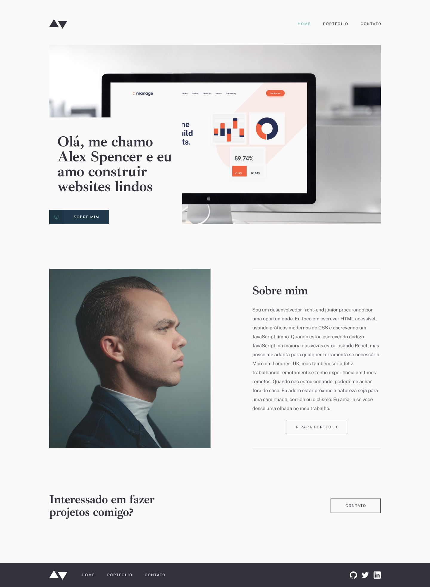
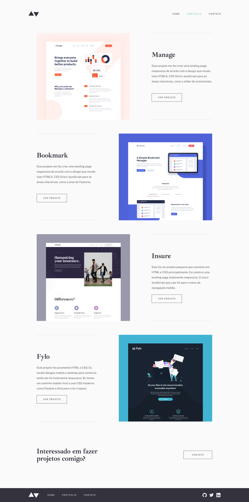
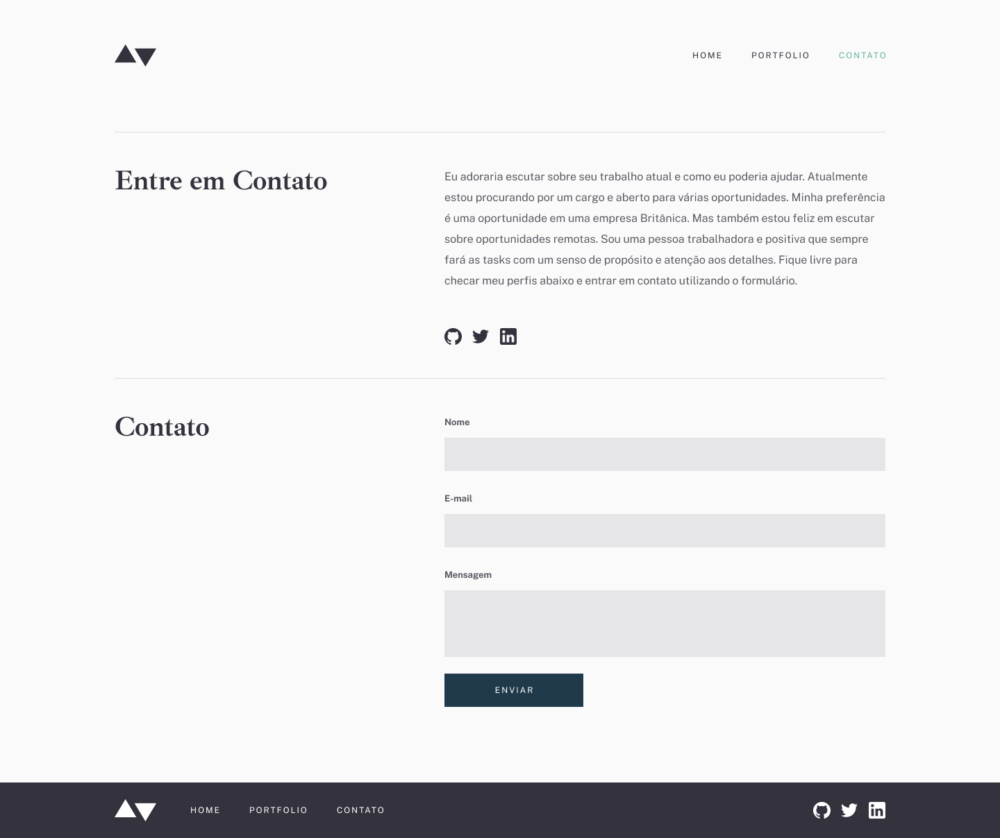

<h1 align="center">
     <a href="https://fiusks-portfolio.netlify.app/home" alt="site do ecoleta"> Portfolio App </a>
</h1>

<div align="center">

[](./README-en.md) [](./README.md)

</div>

## About

This project is a result of the refactoring process of one of the challenges of the Software Development course from [Cubos Academy](https://cubos.academy/), in order to be used as a real portfolio.

All projects developed along the course were in private repositories. Therefore, I'm rebuilding than and implementing new technologies.

The project page can be accessed [here](https://fiusks-portfolio.netlify.app/).

# Table of Contents

<!--ts-->

- [Features](#features)
- [Layout](#layout)
    - [Home](#home)
    - [Portfolio](#portfolio)
    - [Contact](#contact)
- [How to run](#how-to-run)
  - [Requirements](#requirements)
  - [Running the app](#running-the-app)
- [Technologies](#technologies)
- [Author](#author)

<!--te-->


---
## Features

- [x] Responsive layout (web and mobile)
- [x] Multilanguage pages (pt-BR / en-US)
- [x] Form validation
- [x] Handle send e-mail

---

## Layout

Mobile design was not provided during the challenge, but I made some changes to make the page responsive and mobile friendly.

*Below is the original layout of the challenge, which was used as reference for this project.


### Home


### Portfolio
  
### Contact
  

---


## How to run

### Requirements

Before starting, you will the following tools installed on your machine:
[Git](https://git-scm.com), [Node.js](https://nodejs.org/en/).

#### Running the app

```bash

# Clone this repository
$ git clone git@github.com:fiusks/myportfolio.git

# Go to the myportfolio folder
$ cd myportfolio

# Install dependencies
$ npm install

# Run the app
$ npm start

# A aplicação será aberta na porta:3000 - acesse http://localhost:3000

```
---

## Technologies

The following technologies were used for this project:

#### **Frontend** [React](https://reactjs.org/)

- **[EmailJS](https://www.emailjs.com/)**
- **[Flag-icons](https://github.com/lipis/flag-icons)**
- **[Formik](https://formik.org/)**
- **[i18next](https://www.i18next.com/)**
- **[JS-cookie](https://github.com/js-cookie/js-cookie)**
- **[React Bootstrap](https://react-bootstrap.github.io/)**
- **[React Router Dom](https://github.com/ReactTraining/react-router/tree/master/packages/react-router-dom)**
- **[Saas](https://sass-lang.com/)**
- **[Yup](https://github.com/jquense/yup)**


> Check the file [package.json](https://github.com/fiusks/myportfolio/blob/main/package.json)

## Author

<a href="https://blog.rocketseat.com.br/author/thiago/">
 
 <br />
 <sub><b>Rafael Barros</b></sub></a>

[](https://www.linkedin.com/in/rafabarros1/)
[](mailto:rafabarros.com@gmail.com)

---
